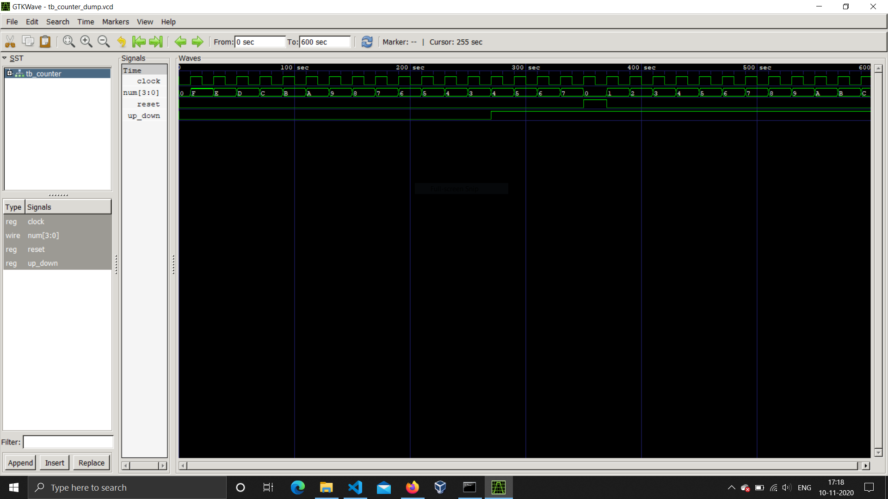

# 4 Bit Counter

A simple up-down counter project made using Icarus Verilog as a part of the Digital Design and Computer Organization course (UE19CS201) at PES University.

## Contents

1. [Installation](#installation)
2. [Requirements](#requirements)
3. [Usage](#usage)
4. [Screenshots](#screenshots)
5. [Authors](#authors)


## Installation

Paste the following command into your terminal to clone the repository.

```bash
$ git clone https://github.com/nihal-ramaswamy/DDCO-project.git
```

## Requirements

To run the project, install the following programs

1.    iVerilog
2.    GtkWave

## Usage

To run the project

```bash
$ cd DDCO-project
$ iverilog counter_4.v counter_4tb.v  
$ vvp a.out  
$ gtkwave tb_counter_dump.vcd
```
Click on ```tb_counter``` in the top left box on GTKWAVE, then drag the signals to the Signals box.

## Screenshots


## Authors

- Nemalli Vishnu Vardhan Reddy [SRN: PES1UG19CS295]
- Nerella Venkata Tarunika [SRN: PES1UG19CS296]
- [Nihal Ramaswamy](https://github.com/nihal-ramaswamy) [SRN: PES1UG19CS297]
- [Nihal Shetty](https://github.com/DragoMark) [SRN: PES1UG19CS298]


